# Generate Documentation Sitemap Task

**Task ID**: generate-doc-sitemap  
**Agent**: doc-health  
**Category**: Organization  
**Priority**: Medium

## Overview

Automatically generates intelligent cross-references, hierarchical sitemaps, and navigation structures for project documentation. Creates topic-based categorization, file relationships, and smart navigation paths to improve documentation discoverability.

## Task Description

This task analyzes the entire documentation structure and creates comprehensive navigation aids including hierarchical sitemaps, topic-based cross-references, file relationship maps, and intelligent navigation paths. It helps users and AI assistants discover relevant documentation efficiently.

## Capabilities

### Sitemap Generation
- **Hierarchical Structure**: Multi-level directory tree with file organization
- **File Metadata**: Size, modification date, and health status for each file
- **Topic Categorization**: Automatic grouping by content type and subject matter
- **Cross-References**: Intelligent linking between related documentation

### Content Analysis
- **Topic Extraction**: Automatic identification of document themes and subjects
- **Keyword Mining**: Extraction of relevant keywords and technical terms
- **Relationship Mapping**: Discovery of connections between documents
- **Content Clustering**: Grouping similar documents for easier navigation

### Navigation Features
- **Quick Links**: Fast access to frequently referenced documents
- **Reading Paths**: Suggested sequences for learning topics
- **Search Optimization**: Enhanced findability through better organization
- **Visual Maps**: Graphical representation of documentation structure

## Input Parameters

### Required
```yaml
project_path: .              # Path to project root
```

### Optional
```yaml
output_formats:             # Output formats to generate
  - markdown                # Human-readable sitemap
  - json                   # Machine-readable structure
  - html                   # Interactive web sitemap
  - mermaid                # Visual diagram
include_metadata: true      # Include file sizes, dates, health status
generate_topics: true       # Extract and categorize topics
create_crossrefs: true      # Generate cross-references
suggest_paths: true         # Create suggested reading paths
include_stats: true         # Include comprehensive statistics
max_depth: 10              # Maximum directory depth to process
exclude_patterns:          # Patterns to exclude
  - "node_modules/**"
  - ".git/**"
  - "**/*.backup"
include_patterns:          # Patterns to include (default: all .md)
  - "**/*.md"
  - "**/*.markdown"
topic_keywords:            # Custom keywords for topic extraction
  - api
  - architecture
  - deployment
  - integration
sort_by: name              # Sort order: name, size, date, health
group_by: directory        # Grouping: directory, topic, type
```

## Execution Flow

### 1. Content Discovery
```bash
🗺️  Discovering documentation structure...
   📁 Scanning directories: 47 folders
   📄 Found files: 1,172 markdown files
   📊 Total size: 14.2 MB
   🏷️  Extracting topics from content...
   
   Directory Structure:
   - docs/ (892 files, 8.4 MB)
   - README.md (1 file, 3.8 KB)
   - backend/ (156 files, 2.1 MB)
   - frontend/ (123 files, 3.7 MB)
```

### 2. Topic Analysis
```bash
🏷️  Analyzing content topics...
   📋 Extracted 47 unique topics
   🔍 Identified 156 keyword clusters
   🎯 Mapped 2,834 topic relationships
   
   Top Topics:
   - API Documentation (234 files)
   - System Architecture (89 files) 
   - Deployment Guides (67 files)
   - Integration Tutorials (156 files)
   - Performance Analysis (78 files)
```

### 3. Cross-Reference Generation
```bash
🔗 Generating cross-references...
   📊 Analyzing 3,247 internal links
   🎯 Discovered 1,567 document relationships
   📋 Created 234 topic clusters
   
   Relationship Types:
   - Parent/Child: 445 relationships
   - Sibling Documents: 678 relationships  
   - Topic References: 444 relationships
```

### 4. Output Generation
```bash
📄 Generating sitemap outputs...
   ✅ Markdown sitemap: docs/automation/sitemap.md
   ✅ JSON structure: docs/automation/sitemap.json
   ✅ HTML sitemap: docs/automation/sitemap.html
   ✅ Mermaid diagram: docs/automation/structure.mmd
   📈 Statistics: 1,172 files categorized and mapped
```

## Output Artifacts

### Markdown Sitemap (`docs/automation/sitemap.md`)
```markdown
# Documentation Sitemap

**Generated**: August 26, 2025 01:30:00  
**Total Files**: 1,172  
**Total Size**: 14.2 MB  
**Health Score**: 94% 🎉

## Quick Navigation

### 🚀 Getting Started
- **[README.md](../README.md)** - Project overview and setup
- **[Quick Start Guide](docs/getting-started/quickstart.md)** - 5-minute setup
- **[Installation](docs/deployment/installation.md)** - Detailed installation

### 📡 API Documentation
- **[API Reference](docs/api/README.md)** - Complete API documentation
- **[Authentication](docs/api/auth.md)** - API authentication guide  
- **[Endpoints](docs/api/endpoints.md)** - All available endpoints
- **[Examples](docs/api/examples.md)** - Code examples and tutorials

### 🏗️ Architecture  
- **[System Overview](docs/architecture/overview.md)** - High-level architecture
- **[Components](docs/architecture/components.md)** - System components
- **[Data Flow](docs/architecture/data-flow.md)** - Data processing flow

## Hierarchical Structure

```
📁 Project Root (1,172 files, 14.2 MB)
├── 📄 README.md (3.8 KB) ✅
├── 📄 CHANGELOG.md (12.4 KB) ✅  
├── 📁 docs/ (892 files, 8.4 MB)
│   ├── 📁 api/ (45 files, 1.2 MB)
│   │   ├── 📄 README.md (15.0 KB) ⚠️
│   │   ├── 📄 authentication.md (8.7 KB) ✅
│   │   └── 📄 endpoints.md (23.4 KB) ❌ OVERSIZED
│   ├── 📁 architecture/ (12 files, 456 KB)
│   │   ├── 📄 overview.md (14.1 KB) ⚠️
│   │   └── 📄 components.md (9.8 KB) ✅
│   └── 📁 deployment/ (8 files, 234 KB)
│       ├── 📄 docker.md (11.2 KB) ✅
│       └── 📄 kubernetes.md (18.9 KB) ❌ OVERSIZED
```

## Topic Index

### API & Integration (289 files)
- Authentication & Security (45 files)
- REST API Endpoints (67 files)  
- WebSocket Integration (23 files)
- Third-party Services (154 files)

### System Architecture (101 files)
- Component Design (34 files)
- Data Architecture (28 files)
- Performance Optimization (39 files)

### Deployment & Operations (78 files) 
- Docker Deployment (23 files)
- Cloud Platforms (34 files)
- Monitoring & Logging (21 files)

## Suggested Reading Paths

### 📚 New Developer Path
1. [README.md](../README.md) - Start here
2. [Quick Start](docs/getting-started/quickstart.md) - Basic setup  
3. [Architecture Overview](docs/architecture/overview.md) - Understand the system
4. [API Basics](docs/api/README.md) - Learn the API
5. [First Integration](docs/tutorials/first-integration.md) - Build something

### 🔧 DevOps Path
1. [Deployment Overview](docs/deployment/README.md) - Deployment basics
2. [Docker Setup](docs/deployment/docker.md) - Container deployment
3. [Monitoring](docs/operations/monitoring.md) - System monitoring
4. [Troubleshooting](docs/operations/troubleshooting.md) - Common issues
```

### JSON Structure (`docs/automation/sitemap.json`)
```json
{
  "generated": "2025-08-26T01:30:00Z",
  "metadata": {
    "total_files": 1172,
    "total_size_bytes": 14892736,
    "health_score": 94,
    "directories": 47,
    "topics": 47
  },
  "structure": {
    "root": {
      "path": ".",
      "files": [
        {
          "name": "README.md",
          "path": "./README.md", 
          "size": 3891,
          "health": "excellent",
          "topics": ["overview", "getting-started"],
          "relationships": ["docs/getting-started/quickstart.md"]
        }
      ],
      "directories": {
        "docs": {
          "files": 892,
          "size": 8808448,
          "subdirectories": ["api", "architecture", "deployment"]
        }
      }
    }
  },
  "topics": {
    "api": {
      "files": 234,
      "keywords": ["endpoint", "authentication", "rest", "websocket"],
      "related_topics": ["integration", "security"]
    }
  },
  "reading_paths": [
    {
      "name": "New Developer",
      "description": "Essential path for new developers",
      "steps": [
        {"file": "README.md", "title": "Project Overview"},
        {"file": "docs/getting-started/quickstart.md", "title": "Quick Setup"}
      ]
    }
  ]
}
```

### HTML Sitemap (`docs/automation/sitemap.html`)
Interactive web-based sitemap with:
- Expandable directory tree
- Search functionality
- Health status indicators
- Topic filtering
- Quick navigation links
- File metadata tooltips

### Mermaid Diagram (`docs/automation/structure.mmd`)

```mermaid
graph TD
    Root["📁 Project Root<br/>1,172 files"]
    
    Root --> README["📄 README.md<br/>3.8 KB ✅"]
    Root --> Docs["📁 docs/<br/>892 files"]
    Root --> Backend["📁 backend/<br/>156 files"] 
    Root --> Frontend["📁 frontend/<br/>123 files"]
    
    Docs --> API["📁 api/<br/>45 files"]
    Docs --> Arch["📁 architecture/<br/>12 files"]
    Docs --> Deploy["📁 deployment/<br/>8 files"]
    
    API --> Auth["📄 auth.md<br/>8.7 KB ✅"]
    API --> Endpoints["📄 endpoints.md<br/>23.4 KB ❌"]
    
    style Root fill:#e1f5fe
    style Docs fill:#f3e5f5  
    style API fill:#e8f5e8
    style Endpoints fill:#ffebee
```


## Usage Examples

### Basic Sitemap Generation
```bash
# Generate all formats
bmad run generate-doc-sitemap

# Markdown only
bmad run generate-doc-sitemap output_formats="['markdown']"

# Include comprehensive metadata
bmad run generate-doc-sitemap include_metadata=true include_stats=true
```

### Advanced Usage
```bash
# Topic-focused generation
bmad run generate-doc-sitemap generate_topics=true suggest_paths=true

# Custom sorting and grouping  
bmad run generate-doc-sitemap sort_by=health group_by=topic

# Specific directory focus
bmad run generate-doc-sitemap project_path=./docs max_depth=3
```

### Integration Examples
```bash
# Update sitemap after documentation changes
bmad hook post-edit generate-doc-sitemap

# Scheduled sitemap updates
bmad schedule generate-doc-sitemap --weekly

# CI/CD integration
bmad run generate-doc-sitemap output_formats="['json']" --quiet
```

## Advanced Features

### Topic Extraction Algorithm
```yaml
Topic Identification:
  1. Extract headings (H1-H3) as primary topics
  2. Analyze filename patterns for subject hints
  3. Scan content for technical keywords
  4. Identify code blocks and their languages
  5. Map relationships through internal links
  6. Cluster similar content using TF-IDF
```

### Reading Path Generation
```yaml
Path Generation Rules:
  1. Start with overview/introduction documents  
  2. Progress from basic to advanced concepts
  3. Group related topics together
  4. Consider typical user workflows
  5. Include hands-on examples and tutorials
  6. End with reference and advanced topics
```

### Health Status Integration
- ✅ **Excellent**: File <10KB, proper structure, no issues
- ⚠️ **Good**: File 10-15KB, minor issues  
- ❌ **Critical**: File >15KB, broken links, structural issues
- 🔧 **Maintenance**: Requires attention or updates

## Performance Considerations

### Large Projects
- Use `max_depth` to limit directory traversal
- Set `include_patterns` to focus on specific files
- Enable caching for repeated generations
- Consider incremental updates for changed files

### Output Size Management
- Limit `output_formats` to required formats only
- Use `include_metadata=false` for smaller outputs
- Set topic limits with custom `topic_keywords`
- Generate focused sitemaps for subsections

---

**Task Version**: 1.0.0  
**Agent Compatibility**: doc-health >=1.0.0  
**Dependencies**: bash, find, grep, sort, jq (optional)  
**Estimated Runtime**: 30s - 3min (depending on project size)