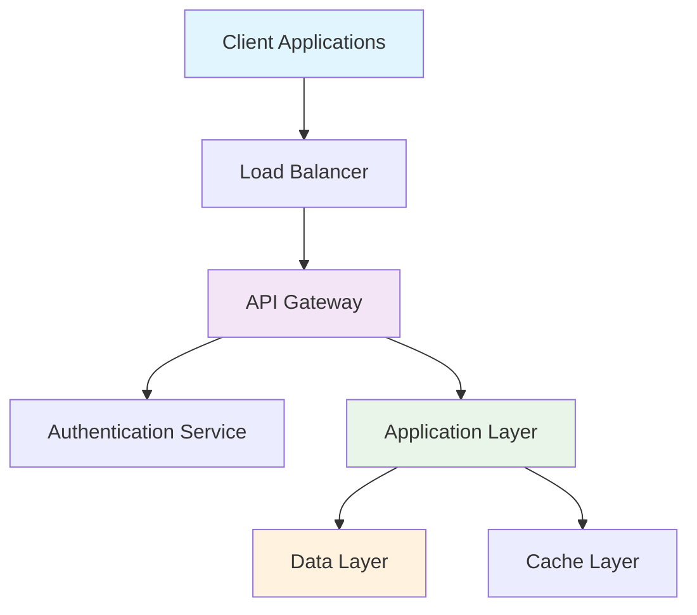
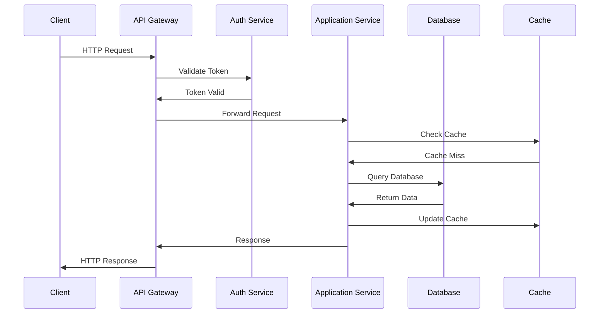
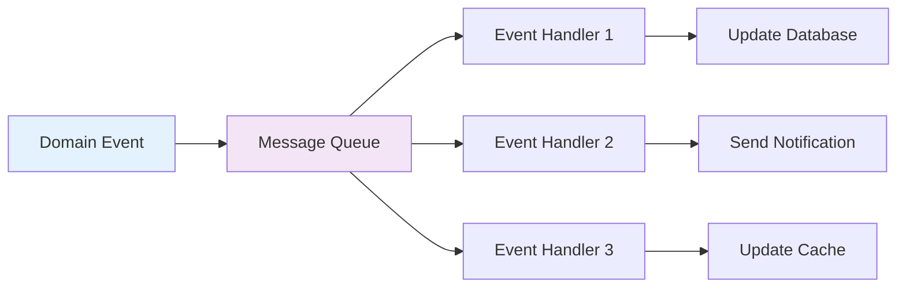

# Architecture Document Template

**Status**: 📋 Template  
**Category**: Architecture Documentation  
**BMAD Package**: doc-automation v1.0.0

## Overview

**Brief architecture description in bold text explaining the system design, purpose, and scope.**

## System Architecture

### High-Level Architecture



### Architecture Principles

#### Design Principles
- **Modularity**: Clear separation of concerns with well-defined interfaces
- **Scalability**: Horizontal and vertical scaling capabilities
- **Reliability**: Fault tolerance and graceful degradation
- **Security**: Defense in depth with multiple security layers
- **Maintainability**: Clean code, documentation, and monitoring

#### Architectural Patterns
- **Microservices Architecture**: Domain-driven service decomposition
- **Event-Driven Architecture**: Asynchronous communication via events
- **CQRS (Command Query Responsibility Segregation)**: Separate read/write models
- **API Gateway Pattern**: Centralized request routing and cross-cutting concerns
- **Circuit Breaker Pattern**: Fault tolerance and cascade failure prevention

## System Components

### Core Services

#### API Gateway
**Purpose**: Central entry point for all client requests  
**Technology**: NGINX, Kong, or AWS API Gateway  
**Responsibilities**:
- Request routing and load balancing
- Authentication and authorization
- Rate limiting and throttling
- Request/response transformation
- Logging and monitoring

**Configuration**:
```yaml
api_gateway:
  port: 8080
  rate_limit: 1000/hour
  timeout: 30s
  authentication:
    - jwt
    - api_key
  routes:
    - path: "/api/v1/users"
      service: "user-service"
      methods: ["GET", "POST"]
```

#### Authentication Service
**Purpose**: User identity management and access control  
**Technology**: OAuth 2.0, JWT, RBAC  
**Responsibilities**:
- User authentication and session management
- Role-based access control (RBAC)
- Token generation and validation
- Single Sign-On (SSO) integration
- Multi-factor authentication (MFA)

**Security Features**:
- Password hashing with bcrypt
- JWT with RS256 signatures
- Session timeout and refresh tokens
- Account lockout policies
- Audit logging for security events

#### Application Services
**Purpose**: Business logic implementation  
**Technology**: [Your technology stack]  
**Architecture**: Domain-driven design with bounded contexts

##### User Management Service
- User registration and profile management
- Account activation and password reset
- Preference and settings management
- User activity tracking

##### Business Logic Service
- Core application functionality
- Workflow orchestration
- Business rule enforcement
- Data validation and processing

### Data Architecture

#### Primary Database
**Type**: [PostgreSQL/MySQL/MongoDB]  
**Purpose**: Persistent data storage for core application data  
**Configuration**:
```yaml
database:
  host: db-primary
  port: 5432
  connections:
    max_pool_size: 20
    connection_timeout: 30s
  backup:
    schedule: "0 2 * * *"  # Daily at 2 AM
    retention: 30d
```

**Schema Design**:
- Normalized relational structure
- Proper indexing strategy
- Foreign key constraints
- Data integrity rules

#### Caching Layer
**Type**: Redis/Memcached  
**Purpose**: High-performance data caching and session storage  
**Strategy**: Write-through caching with TTL-based expiration

**Cache Patterns**:
- **Look-aside**: Application manages cache explicitly
- **Write-through**: Synchronous cache updates
- **Write-behind**: Asynchronous cache updates
- **Refresh-ahead**: Proactive cache warming

#### Message Queue
**Type**: [RabbitMQ/Apache Kafka/AWS SQS]  
**Purpose**: Asynchronous communication and event streaming  
**Patterns**: Publish/Subscribe, Request/Reply, Work Queues

## Technology Stack

### Backend Technologies
- **Runtime**: [Node.js/Python/Java/.NET]
- **Framework**: [Express.js/Django/Spring Boot/ASP.NET Core]
- **Database**: [PostgreSQL/MongoDB/MySQL]
- **Cache**: Redis
- **Message Queue**: [RabbitMQ/Kafka]
- **Search**: [Elasticsearch/Solr]

### Frontend Technologies
- **Framework**: [React/Vue.js/Angular]
- **State Management**: [Redux/Vuex/NgRx]
- **Build Tool**: [Webpack/Vite/Parcel]
- **Styling**: [CSS Modules/Styled Components/Tailwind CSS]

### Infrastructure
- **Container Platform**: Docker + Kubernetes
- **Cloud Provider**: [AWS/Azure/Google Cloud]
- **CI/CD**: [GitHub Actions/GitLab CI/Jenkins]
- **Monitoring**: [Prometheus + Grafana/DataDog/New Relic]
- **Logging**: [ELK Stack/Splunk/CloudWatch]

## Data Flow

### Request Flow


### Event Flow


## Security Architecture

### Security Layers

#### Network Security
- **Firewall Rules**: Restrict network access to essential ports
- **VPC/Virtual Networks**: Isolated network environments
- **Load Balancer SSL**: TLS termination at load balancer
- **DDoS Protection**: Rate limiting and traffic filtering

#### Application Security
- **Authentication**: Multi-factor authentication (MFA)
- **Authorization**: Role-based access control (RBAC)
- **Input Validation**: Sanitization and validation of all inputs
- **Output Encoding**: XSS prevention through proper encoding
- **CSRF Protection**: Anti-CSRF tokens for state-changing operations

#### Data Security
- **Encryption at Rest**: Database and file storage encryption
- **Encryption in Transit**: TLS 1.3 for all communications
- **Key Management**: Hardware security modules (HSM) or key vaults
- **Data Classification**: Sensitive data identification and handling
- **Backup Encryption**: Encrypted backup storage

### Security Monitoring
```yaml
security_monitoring:
  authentication_failures:
    threshold: 5 attempts/5min
    action: account_lockout
  
  suspicious_activity:
    unusual_login_locations: true
    multiple_concurrent_sessions: true
    privilege_escalation_attempts: true
  
  data_access:
    audit_all_access: true
    alert_bulk_exports: true
    monitor_admin_actions: true
```

## Scalability & Performance

### Horizontal Scaling
- **Application Layer**: Stateless services with load balancing
- **Database Layer**: Read replicas and sharding strategies
- **Cache Layer**: Redis cluster with consistent hashing
- **Message Queue**: Partitioned topics and consumer groups

### Vertical Scaling
- **CPU Optimization**: Profiling and performance tuning
- **Memory Optimization**: Efficient data structures and caching
- **I/O Optimization**: Connection pooling and batch operations
- **Network Optimization**: CDN and edge caching

### Performance Targets
| Component | Metric | Target | Current |
|-----------|--------|--------|---------|
| API Gateway | Response Time (95th) | < 100ms | 85ms |
| Database | Query Time (95th) | < 50ms | 35ms |
| Cache Hit Rate | Cache Efficiency | > 90% | 94% |
| Application | Throughput | > 1000 RPS | 1250 RPS |

## Monitoring & Observability

### Application Monitoring
```yaml
monitoring:
  metrics:
    - request_duration
    - request_rate
    - error_rate
    - active_connections
    - memory_usage
    - cpu_utilization
  
  alerts:
    - name: "High Error Rate"
      condition: "error_rate > 5%"
      severity: "critical"
    
    - name: "High Response Time"
      condition: "response_time_95th > 500ms"
      severity: "warning"
```

### Health Checks
```yaml
health_checks:
  api_gateway:
    endpoint: "/health"
    interval: 30s
    timeout: 5s
  
  database:
    query: "SELECT 1"
    interval: 60s
    timeout: 10s
  
  external_services:
    dependencies:
      - payment_service
      - notification_service
    timeout: 15s
```

### Logging Strategy
- **Structured Logging**: JSON format with consistent fields
- **Log Levels**: DEBUG, INFO, WARN, ERROR, FATAL
- **Centralized Logging**: Aggregation in centralized logging system
- **Log Retention**: 30 days for INFO, 90 days for WARN/ERROR
- **Security Logs**: Separate security event logging

## Deployment Architecture

### Environments
```yaml
environments:
  development:
    infrastructure: local_containers
    database: single_instance
    external_services: mocked
  
  staging:
    infrastructure: cloud_minimal
    database: single_instance
    external_services: staging_endpoints
  
  production:
    infrastructure: cloud_redundant
    database: clustered
    external_services: production_endpoints
```

### CI/CD Pipeline
```yaml
pipeline:
  stages:
    - source: git_checkout
    - build: compile_and_package
    - test: unit_and_integration_tests
    - security: vulnerability_scanning
    - deploy_staging: automated_deployment
    - qa: manual_testing
    - deploy_production: blue_green_deployment
    - monitoring: health_checks_and_alerts
```

### Disaster Recovery
- **Backup Strategy**: Daily automated backups with 30-day retention
- **Recovery Time Objective (RTO)**: 4 hours
- **Recovery Point Objective (RPO)**: 1 hour
- **Failover Process**: Automated failover with manual validation
- **Geo-Redundancy**: Multi-region deployment for critical services

## Migration Strategy

### Phase 1: Foundation (Week 1-2)
- Infrastructure setup and basic services
- Database schema creation
- Authentication service implementation
- Basic API gateway configuration

### Phase 2: Core Services (Week 3-6)
- Primary application services
- Business logic implementation
- Data migration from legacy systems
- Basic monitoring and logging

### Phase 3: Advanced Features (Week 7-10)
- Performance optimization
- Advanced security features
- Comprehensive monitoring
- Load testing and capacity planning

### Phase 4: Production (Week 11-12)
- Production deployment
- User acceptance testing
- Documentation completion
- Team training and handover

## Risk Assessment

### Technical Risks
| Risk | Probability | Impact | Mitigation |
|------|------------|---------|------------|
| Database Performance | Medium | High | Implement read replicas and caching |
| Third-party Service Outage | High | Medium | Circuit breakers and fallback mechanisms |
| Security Breach | Low | Critical | Multi-layer security and monitoring |
| Scalability Issues | Medium | High | Load testing and auto-scaling |

### Operational Risks
- **Team Knowledge**: Document architecture and provide training
- **Vendor Lock-in**: Use open standards and portable solutions
- **Technical Debt**: Regular refactoring and code reviews
- **Compliance**: Regular security audits and compliance checks

## Future Considerations

### Planned Enhancements
- **Microservices Migration**: Gradual decomposition of monolithic components
- **Machine Learning Integration**: Analytics and predictive capabilities
- **Mobile API**: Dedicated mobile application support
- **GraphQL**: Alternative query interface for flexible data access

### Technology Evolution
- **Container Orchestration**: Advanced Kubernetes features
- **Serverless**: Function-as-a-Service for specific workloads
- **Edge Computing**: CDN and edge processing capabilities
- **AI/ML Platform**: Integrated machine learning pipeline

---

**Document Information**:
- **Version**: 1.0.0
- **Author**: [Your Name]
- **Reviewers**: [Architecture Team]
- **Last Updated**: $(date)
- **Next Review**: [Date + 6 months]

**Generated by**: BMAD Documentation Template System  
**Template**: architecture-document.md  

## Template Usage

This template should be customized by:
1. Replacing placeholder technology stack with actual choices
2. Adding specific system diagrams and flows
3. Updating performance targets with real metrics
4. Including actual security requirements
5. Adding project-specific risks and mitigation strategies

### BMAD Commands for Architecture Documentation

```bash
# Apply this template to new architecture doc
bmad apply template architecture-document target=docs/architecture/new-system.md

# Validate architecture documentation standards
bmad run check-doc-health include_patterns="['docs/architecture/**']"

# Generate architecture cross-references
bmad run generate-doc-sitemap include_patterns="['docs/architecture/**']" group_by=category
```