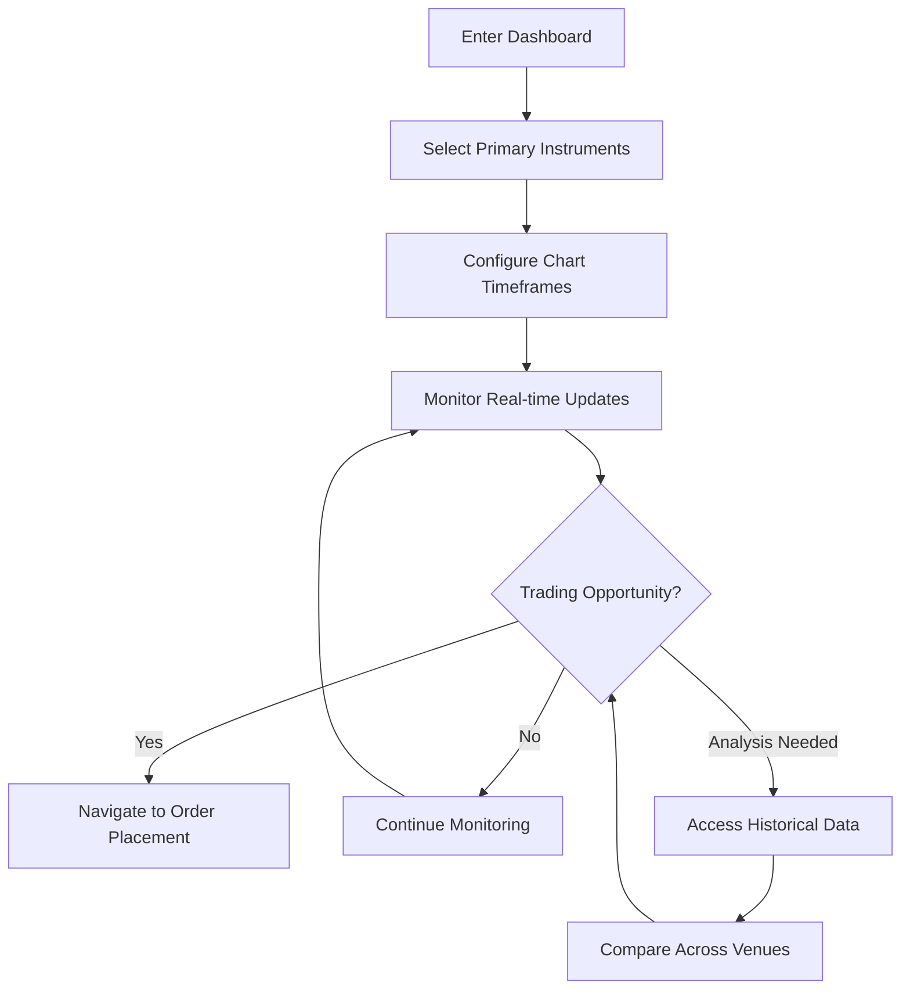
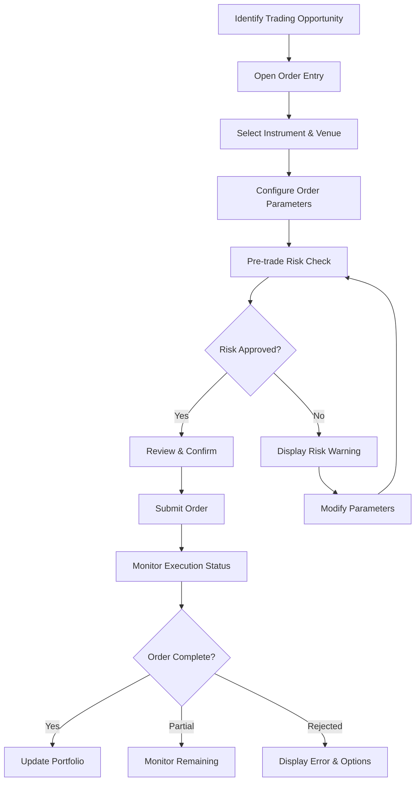
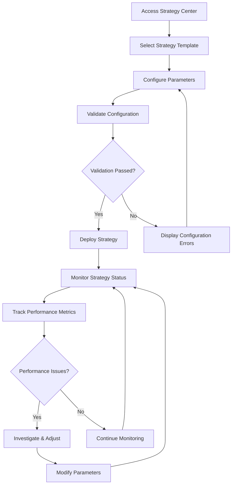

# NautilusTrader Web Dashboard UI/UX Specification

## Introduction

This document defines the user experience goals, information architecture, user flows, and visual design specifications for NautilusTrader Web Dashboard's user interface. It serves as the foundation for visual design and frontend development, ensuring a cohesive and user-centered experience.

### Overall UX Goals & Principles

#### Target User Personas

**Primary Persona - Quantitative Trader:**
- Professional traders using algorithmic strategies
- Requires real-time market data and execution capabilities
- Values performance, accuracy, and comprehensive analytics
- Comfortable with complex interfaces but expects intuitive workflows
- Needs to monitor multiple venues and strategies simultaneously

**Secondary Persona - Portfolio Manager:**
- Oversight of multiple trading strategies and risk management
- Focuses on portfolio-level analytics and performance monitoring
- Requires clear visualization of exposures and P&L attribution
- Values comprehensive reporting and historical analysis capabilities

#### Usability Goals

1. **Speed of Execution:** Critical trading actions (order placement, position monitoring) completable in under 3 seconds
2. **Information Density:** Display maximum relevant information without cognitive overload
3. **Latency Awareness:** Visual feedback for all real-time updates within 100ms requirement
4. **Error Prevention:** Clear validation and confirmation for high-risk actions (order placement, strategy deployment)
5. **Situational Awareness:** Immediate visibility of system status, market conditions, and portfolio health

#### Design Principles

1. **Performance Over Polish** - Prioritize rendering speed and data accuracy over visual flourishes
2. **Information Hierarchy** - Most critical trading data gets primary visual prominence
3. **Contextual Clarity** - Every piece of information includes necessary context (timestamps, venues, currencies)
4. **Predictable Patterns** - Consistent interaction patterns across all trading operations
5. **Graceful Degradation** - System remains functional even when some data feeds are unavailable

#### Change Log

| Date | Version | Description | Author |
|------|---------|-------------|---------|
| 2025-08-16 | 1.0 | Initial UI/UX specification creation | Sally (UX Expert) |

## Information Architecture (IA)

### Site Map / Screen Inventory

```mermaid
graph TD
    A[Main Trading Dashboard] --> B[Market Data Hub]
    A --> C[Strategy Management Center]
    A --> D[Risk & Portfolio Overview]
    A --> E[Order Management Interface]
    A --> F[System Status Monitor]
    
    B --> B1[Multi-Venue Market Overview]
    B --> B2[Instrument Selection]
    B --> B3[Order Book Depth]
    B --> B4[Multi-Timeframe Charts]
    
    C --> C1[Strategy Configuration]
    C --> C2[Strategy Deployment]
    C --> C3[Performance Analysis]
    C --> C4[Strategy Monitoring]
    
    D --> D1[Portfolio Positions]
    D --> D2[Real-time P&L]
    D --> D3[Risk Metrics]
    D --> D4[Exposure Monitoring]
    
    E --> E1[Active Orders]
    E --> E2[Order Placement]
    E --> E3[Trade History]
    E --> E4[Execution Analytics]
    
    F --> F1[Connection Health]
    F --> F2[Latency Metrics]
    F --> F3[Alert Management]
    F --> F4[System Performance]
```

### Navigation Structure

**Primary Navigation:** Top-level tabs for each major functional area (Market Data, Trading, Strategy Management, Portfolio, System Status). Always visible with clear active state indicators.

**Secondary Navigation:** Context-sensitive sidebar navigation within each primary area. For example, within Strategy Management: Configuration → Deployment → Monitoring → Analysis.

**Breadcrumb Strategy:** Minimal breadcrumbs only for deep navigation paths (e.g., Strategy Management > Strategy X > Performance Analysis > Historical View). Primary focus on maintaining context through persistent UI elements rather than navigation trails.

## User Flows

### Flow 1: Real-time Market Monitoring & Analysis

**User Goal:** Monitor market conditions across multiple venues and instruments to identify trading opportunities

**Entry Points:** 
- Main Trading Dashboard (primary)
- Direct bookmark to Market Data Hub
- Alert notifications from risk monitoring

**Success Criteria:** 
- User can view real-time market data within 100ms of updates
- Multi-venue comparison available in single view
- Historical context readily accessible for decision-making

**Flow Diagram:**

**Edge Cases & Error Handling:**
- Data feed disconnection: Display last known data with clear timestamp and reconnection status
- Venue-specific outages: Highlight affected instruments with alternative venue options
- High-frequency data overflow: Implement throttling with user notification of sampling rate
- Chart rendering failures: Fallback to tabular data display

### Flow 2: Order Placement & Execution

**User Goal:** Execute trades quickly and accurately with proper risk validation

**Entry Points:**
- Order placement widget from Main Dashboard
- Context menu from chart interactions
- Direct navigation from market analysis

**Success Criteria:**
- Order placement completed within 3 seconds from decision
- Pre-trade risk validation without blocking workflow
- Real-time execution feedback and confirmation

**Flow Diagram:**

**Edge Cases & Error Handling:**
- Venue connectivity issues: Automatic fallback to alternative venues where possible
- Insufficient margin: Clear display of required margin with position adjustment options
- Market closure: Queue orders with clear scheduling information
- Order rejection: Detailed rejection reason with suggested parameter adjustments

### Flow 3: Strategy Deployment & Monitoring

**User Goal:** Deploy algorithmic strategies and monitor their performance in real-time

**Entry Points:**
- Strategy Management Center
- Quick deployment from existing strategy templates
- Alert-triggered strategy modifications

**Success Criteria:**
- Strategy deployment within 30 seconds including validation
- Real-time strategy performance visibility
- Immediate stop/modification capabilities for risk management

**Flow Diagram:**

**Edge Cases & Error Handling:**
- Strategy deployment failures: Rollback capability with detailed error logging
- Performance degradation: Automated alerts with manual intervention options
- Market condition changes: Strategy adaptation recommendations
- Resource constraints: Clear resource usage display with optimization suggestions

## Wireframes & Mockups

**Primary Design Files:** [To be created in Figma - recommend creating a dedicated project called "NautilusTrader Dashboard" with frames for each major screen and component library]

### Key Screen Layouts

#### Main Trading Dashboard

**Purpose:** Central command center providing real-time overview of all critical trading information with quick access to detailed views

**Key Elements:**
- Multi-panel grid layout optimized for ultrawide displays (2560x1440+)
- Real-time market data ticker across top
- Primary chart view (configurable instrument) in center-left
- Order book depth visualization in center-right
- Active positions summary panel (bottom-left)
- Recent orders/executions log (bottom-right)
- System status indicators in header
- Quick order entry widget (floating/sidebar)

**Interaction Notes:** All panels support click-to-expand for detailed views. Drag-and-drop for instrument assignment to different panels. Keyboard shortcuts for rapid order entry and chart navigation.

**Design File Reference:** [Frame: Main-Dashboard-Overview]

#### Strategy Management Center

**Purpose:** Comprehensive interface for configuring, deploying, and monitoring algorithmic trading strategies

**Key Elements:**
- Strategy library browser (left sidebar)
- Central configuration workspace with tabbed parameter sections
- Real-time strategy performance metrics panel
- Strategy state timeline showing deployment/modification history
- Live P&L attribution by strategy
- Risk exposure breakdown per strategy
- Quick deploy/stop/modify action buttons

**Interaction Notes:** Parameter validation happens in real-time as users type. Strategy comparison view supports side-by-side analysis. Deployment requires explicit confirmation dialog for risk management.

**Design File Reference:** [Frame: Strategy-Management-Main]

#### Order Management Interface

**Purpose:** Comprehensive order lifecycle management with real-time execution monitoring

**Key Elements:**
- Active orders table with real-time status updates
- Order placement form with advanced options
- Execution history with detailed fill information
- Order routing visualization showing venue selection
- Cancel/modify bulk actions
- Trade blotter with P&L calculations
- Order performance analytics (slippage, timing)

**Interaction Notes:** Orders support inline editing for quantity/price modifications. Execution notifications appear as non-blocking toasts. Historical orders support advanced filtering and export functionality.

**Design File Reference:** [Frame: Order-Management-Hub]

#### Risk & Portfolio Overview

**Purpose:** Real-time portfolio monitoring and risk management dashboard for institutional oversight

**Key Elements:**
- Portfolio composition heat map by asset class/venue
- Real-time P&L waterfall chart
- Risk metrics dashboard (VaR, exposure, concentration)
- Margin utilization gauges
- Position size visualization with limit indicators
- Alert management panel for risk threshold breaches
- Correlation matrix for strategy/asset relationships

**Interaction Notes:** Risk thresholds are user-configurable with immediate visual feedback. Position sizing supports drill-down to individual instruments. All metrics update in real-time with visual change indicators.

**Design File Reference:** [Frame: Risk-Portfolio-Dashboard]

## Component Library / Design System

**Design System Approach:** Create a custom financial-focused design system built on Ant Design foundation, optimized for real-time data display and trading operations. This hybrid approach leverages Ant Design's proven patterns while adding specialized financial components and performance optimizations for your <100ms update requirements.

### Core Components

#### TradingDataGrid

**Purpose:** High-performance data table optimized for real-time financial data updates with virtualization support

**Variants:**
- Basic grid (static data)
- Live grid (real-time updates)
- Sortable/filterable grid
- Compact grid (higher density)

**States:**
- Default, Loading, Error, Empty
- Cell-level states: Updated (flash), Positive/Negative (value changes), Alert (threshold breach)

**Usage Guidelines:** Use for any tabular financial data. Implement cell-level update animations for real-time changes. Support keyboard navigation for accessibility and trader efficiency.

#### OrderEntryWidget

**Purpose:** Standardized order placement interface with built-in validation and risk checks

**Variants:**
- Quick order (market/limit)
- Advanced order (stop, conditional)
- Bulk order entry
- Mobile-optimized version

**States:**
- Default, Validating, Valid, Invalid, Submitting, Success, Error

**Usage Guidelines:** Always include pre-trade risk validation. Provide clear visual feedback for each state. Support hotkey shortcuts for experienced traders.

#### RealTimeChart

**Purpose:** Financial charting component wrapping Lightweight Charts with NautilusTrader data integration

**Variants:**
- Candlestick chart
- Line chart
- Volume profile
- Multi-timeframe sync

**States:**
- Loading, Active (streaming), Paused, Error, Offline

**Usage Guidelines:** Maintain consistent color schemes across all chart types. Implement smooth real-time updates without jarring visual changes. Support chart annotations and drawing tools.

#### StatusIndicator

**Purpose:** System and connection health visualization for critical trading infrastructure monitoring

**Variants:**
- Connection status (venue, data feed)
- System health (latency, performance)
- Trading status (market open/closed)
- Alert severity levels

**States:**
- Healthy (green), Warning (amber), Critical (red), Unknown (gray), Offline (dark)

**Usage Guidelines:** Use consistent color coding across all status indicators. Include hover tooltips with detailed information. Animate state changes to draw attention.

#### PositionSummaryCard

**Purpose:** Compact position display showing key metrics and real-time P&L updates

**Variants:**
- Single position card
- Portfolio summary card
- Strategy position grouping

**States:**
- Profitable, Loss-making, Break-even, Loading, Error

**Usage Guidelines:** Use green/red color coding for P&L. Include percentage and absolute value changes. Support click-through to detailed position view.

#### AlertBanner

**Purpose:** Critical notification system for trading alerts and system messages

**Variants:**
- Risk alert (critical)
- System notification (info)
- Market event (warning)
- Success confirmation

**States:**
- Active, Dismissible, Auto-dismiss, Persistent

**Usage Guidelines:** Risk alerts require explicit user acknowledgment. Use appropriate urgency indicators (color, animation). Stack multiple alerts with priority ordering.

#### TradingButton

**Purpose:** High-visibility action buttons for trading operations with confirmation patterns

**Variants:**
- Primary action (Buy/Sell)
- Secondary action (Cancel/Modify)
- Danger action (Stop/Emergency)
- Quick action (one-click execution)

**States:**
- Default, Hover, Active, Loading, Disabled, Confirmed

**Usage Guidelines:** Danger actions require confirmation. Use consistent sizing for muscle memory. Include loading states for network operations.

## Branding & Style Guide

### Visual Identity

**Brand Guidelines:** Follow standard financial terminal aesthetics with modern refinements. Reference Bloomberg Terminal, Interactive Brokers TWS, and TradingView Pro for established professional patterns while maintaining unique identity for NautilusTrader ecosystem.

### Color Palette

| Color Type | Hex Code | Usage |
|------------|----------|-------|
| Primary | #1890FF | Primary actions, links, selected states |
| Secondary | #722ED1 | Secondary actions, strategy indicators |
| Accent | #13C2C2 | Highlights, notifications, focus states |
| Success | #52C41A | Profitable positions, positive P&L, confirmations |
| Warning | #FAAD14 | Risk warnings, important notices, pending states |
| Error | #FF4D4F | Losses, errors, destructive actions, alerts |
| Neutral | #F0F2F5, #8C8C8C, #434343, #1F1F1F | Text hierarchy, borders, backgrounds |

### Typography

#### Font Families
- **Primary:** Inter (clean, professional sans-serif for UI text)
- **Secondary:** Roboto (high legibility for dense information)
- **Monospace:** JetBrains Mono (numerical data, code, timestamps)

#### Type Scale

| Element | Size | Weight | Line Height |
|---------|------|--------|-------------|
| H1 | 24px | 600 | 32px |
| H2 | 20px | 600 | 28px |
| H3 | 16px | 600 | 24px |
| Body | 14px | 400 | 22px |
| Small | 12px | 400 | 20px |

### Iconography

**Icon Library:** Ant Design Icons as foundation, supplemented with custom financial icons (order types, chart patterns, trading actions)

**Usage Guidelines:** 
- Use 16px icons for dense interfaces, 20px for primary actions
- Maintain consistent visual weight across icon families
- Custom financial icons follow same stroke weight and corner radius as Ant Design
- Critical actions use filled icons, secondary actions use outlined icons

### Spacing & Layout

**Grid System:** 24-column grid system (divisible by 2, 3, 4, 6, 8, 12) optimized for financial data layouts and multi-panel displays

**Spacing Scale:** 4px base unit progression: 4px, 8px, 12px, 16px, 24px, 32px, 48px, 64px for consistent rhythm and alignment

## Accessibility Requirements

### Compliance Target

**Standard:** WCAG 2.1 AA compliance with performance exceptions. Focus on keyboard navigation, screen reader compatibility, and visual accessibility while maintaining the <100ms update performance requirement specified in your PRD.

### Key Requirements

**Visual:**
- Color contrast ratios: 4.5:1 minimum for normal text, 3:1 for large text and UI components
- Focus indicators: High-contrast 2px outline on all interactive elements, visible against dark trading interface backgrounds
- Text sizing: Support browser zoom up to 200% without horizontal scrolling or loss of functionality

**Interaction:**
- Keyboard navigation: Full keyboard access to all trading functions with logical tab order and escape routes
- Screen reader support: Proper ARIA labels for real-time data updates, live regions for critical trading alerts
- Touch targets: Minimum 44px for mobile/tablet views (desktop optimized for precision mouse interactions)

**Content:**
- Alternative text: Descriptive alt text for charts and data visualizations, with data table alternatives for complex graphics
- Heading structure: Logical H1-H6 hierarchy for screen reader navigation of complex trading interfaces
- Form labels: Clear labels and instructions for all order entry and configuration forms, with inline validation messages

### Testing Strategy

**Automated Testing:** Integrate axe-core accessibility testing into CI/CD pipeline to catch basic violations before deployment. Run weekly comprehensive scans on all major user flows.

**Manual Testing:** Monthly keyboard-only navigation testing of critical trading workflows (market monitoring, order placement, strategy management). Quarterly screen reader testing with NVDA/JAWS for data table navigation and live update announcements.

**Performance Accessibility Balance:** Real-time data updates may require reduced screen reader verbosity to maintain trading performance. Implement configurable announcement frequency for high-frequency data streams.

## Responsiveness Strategy

### Breakpoints

| Breakpoint | Min Width | Max Width | Target Devices |
|------------|-----------|-----------|----------------|
| Mobile | 320px | 767px | Emergency access only (tablets in portrait) |
| Tablet | 768px | 1439px | Secondary monitoring (tablets in landscape) |
| Desktop | 1440px | 2559px | Primary trading workstations (standard monitors) |
| Wide | 2560px | - | Professional trading setups (ultrawide displays) |

### Adaptation Patterns

**Layout Changes:** 
- Wide displays: 6-panel dashboard layout with dedicated areas for charts, order books, positions, and orders
- Desktop: 4-panel layout with collapsible sidebars for secondary information
- Tablet: 2-panel stacked layout with tabs for additional data views
- Mobile: Single-panel sequential views with bottom navigation

**Navigation Changes:**
- Wide/Desktop: Persistent top navigation with sidebar panels
- Tablet: Top navigation with drawer-based secondary menus
- Mobile: Bottom tab navigation with minimal header, focus on core trading functions only

**Content Priority:**
- Wide: All data visible simultaneously with real-time updates
- Desktop: Primary data visible, secondary data in collapsible panels
- Tablet: Essential trading data prioritized, analytics in separate views
- Mobile: Core monitoring only (positions, alerts, emergency order management)

**Interaction Changes:**
- Wide/Desktop: Mouse-optimized with hover states and right-click context menus
- Tablet: Touch-optimized with larger tap targets and swipe gestures
- Mobile: Single-finger interactions with simplified order entry workflows

## Animation & Micro-interactions

### Motion Principles

**Performance-First Animation:** All animations must support rather than hinder trading performance. Real-time data updates take priority over decorative motion. Use animation to communicate state changes, guide attention to critical information, and provide immediate feedback for user actions without creating visual noise during rapid market movements.

### Key Animations

- **Data Update Flash:** Subtle cell background flash on value changes (Duration: 150ms, Easing: ease-out)
- **Order Status Transition:** Progressive color transition for order state changes (Duration: 300ms, Easing: ease-in-out)  
- **Alert Slide-In:** Critical alerts slide from top with bounce attention (Duration: 500ms, Easing: cubic-bezier(0.68, -0.55, 0.265, 1.55))
- **Panel Expansion:** Smooth panel resize for detailed views (Duration: 250ms, Easing: ease-in-out)
- **Connection Status Pulse:** Gentle pulsing for reconnection states (Duration: 1000ms, Easing: ease-in-out, Infinite)
- **Hover State Transition:** Immediate button/link hover feedback (Duration: 100ms, Easing: ease-out)
- **Loading Spinner:** Professional loading indicator for data fetching (Duration: 800ms, Easing: linear, Infinite)
- **Confirmation Dialog:** Modal appearance with backdrop fade (Duration: 200ms, Easing: ease-out)
- **Chart Crosshair:** Smooth crosshair movement following mouse (Duration: 50ms, Easing: linear)
- **Tab Switching:** Instant content swap with subtle underline slide (Duration: 150ms, Easing: ease-out)

## Performance Considerations

### Performance Goals

- **Page Load:** Initial dashboard load under 2 seconds on standard broadband connections
- **Interaction Response:** All user interactions (clicks, form inputs, navigation) respond within 100ms
- **Animation FPS:** Maintain 60 FPS for all animations and real-time data updates during peak market activity

### Design Strategies

**Efficient Rendering Architecture:** Implement React virtualization for large data sets (trade history, order books), use CSS containment for isolated panel updates, minimize DOM reflows through fixed panel layouts, and leverage Web Workers for complex calculations (P&L attribution, risk metrics) that don't block UI rendering.

**Real-Time Data Optimization:** Implement intelligent update throttling that batches rapid market data updates while preserving critical price movements, use differential updates to only re-render changed data cells, implement progressive enhancement where secondary data loads after critical trading information, and utilize WebSocket connection pooling for efficient real-time communication with NautilusTrader backend.

**Memory Management:** Implement data windowing for historical data to prevent memory leaks during extended trading sessions, use object pooling for frequently created/destroyed components (order entries, data rows), implement proper cleanup for event listeners and subscriptions, and cache frequently accessed reference data (instrument details, venue information) with intelligent refresh policies.

**Visual Performance:** Use CSS transforms for all animations to leverage GPU acceleration, implement smart repainting strategies that isolate update regions, minimize expensive CSS operations (box-shadow, filters) during real-time updates, and use efficient data visualization libraries (Lightweight Charts) optimized for financial data rendering.

## Next Steps

### Immediate Actions

1. **Stakeholder Review & Approval** - Schedule review session with product owner and key traders to validate UX goals, user flows, and component specifications before development begins

2. **Design System Implementation** - Create Figma design system with all defined components, color palette, and typography specifications for visual design handoff

3. **Technical Architecture Handoff** - Collaborate with Design Architect to ensure UI/UX specifications align with React/FastAPI technical architecture and performance requirements

4. **User Flow Validation** - Conduct usability testing of wireframed flows with target traders to validate critical workflows before detailed visual design

5. **Performance Prototype** - Create high-fidelity prototype focused on real-time data update performance to validate <100ms requirement feasibility

6. **Component Development Planning** - Prioritize component library development starting with TradingDataGrid and RealTimeChart as foundation components

### Design Handoff Checklist

- [x] All user flows documented
- [x] Component inventory complete  
- [x] Accessibility requirements defined
- [x] Responsive strategy clear
- [x] Brand guidelines incorporated
- [x] Performance goals established